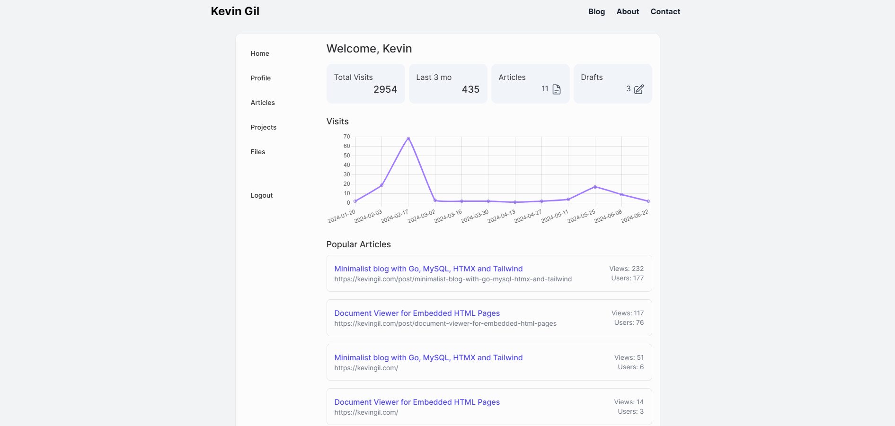

# Personal Blog

[](https://github.com/kevingil/blog/actions/workflows/deploy.yml)
[](https://github.com/kevingil/blog/actions/workflows/build.yml)
[](https://github.com/kevingil/blog/actions/workflows/devbuild.yml)


Blog and CMS engine written in Go


[](web/images/blog-screenshot-1.png)


## Develop

#### Download and install
- Go 
- Docker (optional)

#### Download dependencies

`go mod download`


#### .env example 

This project integrates with a few services, you will need: S3 (or R2) API keys for storage and Google service account key for analytics.

```sh
PORT=80 #can change for development
MYSQL_HOST=xxxxxx
MYSQL_PORT=xxxxxx
MYSQL_USER=xxxxxx
MYSQL_PASSWORD=xxxxxx
MYSQL_DATABASE=xxxxxx
MYSQL_ROOT_PASSWORD=xxxxxx
RESTORE_URL=xxxxxx
OPENAI_API_KEY=sk-xxxxxx
CDN_BUCKET_NAME=xxxxxx
CDN_ACCOUNT_ID=xxxxxx
CDN_ACCESS_KEY_ID=xxxxxx
CDN_ACCESS_KEY_SECRET=xxxxxx
CDN_SESSION_TOKEN=xxxxxx
CDN_API_ENDPOINT=xxxxx
CDN_URL_PREFIX=xxx
GA_PROPERTYID=xxxxx
GA_SERVICE_ACCOUNT_JSON_PATH=/path/to/service-account-key.json

```

#### First run
You can register at /register


## Demo

[kevingil.com](https://kevingil.com/)


